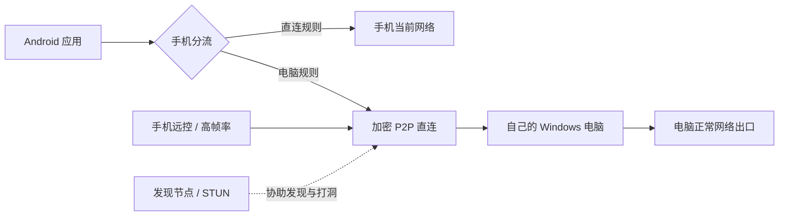

# 随连 · SuiLian

**Android 智能分流、连接自己的 Windows 电脑、日常远控与高帧率串流。**

随连把长期运行的网络连接与按需开启的远控放在同一个 APK 中：手机先按应用和域名分流，需要电脑的请求才通过加密 P2P 通道到达电脑，再使用电脑本身的网络出口。

这是从 **0.3.17 测试版**整理的开源开发者版本。仓库提供双端源码、组件补丁、依赖锁定和构建工具；目前没有公开签名的安装包。请先阅读[构建说明](docs/BUILD.md)与[已知限制](docs/LIMITATIONS.md)。



## 能做什么

| 功能 | 实现与边界 |
|---|---|
| 手机智能分流 | Mihomo + Android VpnService；可按应用完全绕过 VPN，或按域名选择手机 / 电脑线路 |
| 电脑直连 | EasyTier 加密组网，双方禁止业务中继回退；不保证所有 NAT 环境都能直连 |
| 日常远控 | 集成 RustDesk 手机界面；电脑管理器准备直接访问和配对凭据 |
| 高帧率串流 | 集成 Moonlight，电脑端准备 Sunshine；帧率取决于编码器、网络和手机解码能力 |
| AI 真机联调 | 仅在已配对远控会话中，经手机本次授权后提供 ADB 通道；退出会话关闭通道 |
| 连接与流量 | 手机应用、域名/IP、线路、用量及历史筛选；可达时约每 30 秒自动同步到电脑 |
| 电脑管理 | Windows 独立管理界面、配对二维码、USB 准备、组件状态和完整退出 |

完全绕过 VPN 的应用不经过随连，也不会被随连统计。普通 DIRECT 规则仍由 VPN 内核分流后从手机原网络发出。系统是否显示 VPN、某个应用是否拒绝 VPN 环境，是另一层判断。

## 使用流程

1. 按[构建说明](docs/BUILD.md)生成 Android 测试 APK 和 Windows 完整运行目录。
2. Windows 运行 `WangChuanManager.exe`，点击“一键准备连接”，按系统提示允许所需管理员权限。
3. 手机安装自己构建的 APK，扫描电脑配对二维码，允许 Android VPN 授权，开启连接。
4. 在“应用”中设置绕过名单或查看历史；在“远控”中按需进入日常远控 / 高帧率模式。
5. 电脑需保持开机联网。需要常驻时选择“后台运行”；“彻底退出”会停止本程序所属组件。

首次无线调试、USB 调试、部分厂商的 USB 安装、系统解锁等授权必须由设备所有者完成。具体步骤见[真机联调](docs/DEVELOPMENT.md)。不要把配对二维码发给别人。

## 开发入口

| 目录 | 内容 |
|---|---|
| `android/` | Kotlin 主界面、分流与保活、历史统计、远控桥接、Moonlight Java 模块 |
| `companion/` | Go 电脑端、配对、代理出口、连接状态、历史同步、远控与联调管理 |
| `desktop/` | Windows C# 管理界面、图标、流量表格、进程生命周期 |
| `native/core/` | FlClash Go/C 桥接源码及随连改动 |
| `patches/` | 针对固定 Mihomo / RustDesk 版本的完整集成补丁 |
| `tools/` | 校验下载、构建、打包、USB 准备与源码检查 |
| `tests/` | Windows 生命周期、USB 授权和协议回归测试 |

```powershell
git clone https://github.com/wanger2026/suilian.git
cd suilian
# 安装并配置 Go 1.26、Python 3.10+ 后，可先验证电脑端源码。
cd companion
go test ./...
go vet ./...
```

完整 SDK 版本与构建顺序见 [docs/BUILD.md](docs/BUILD.md)。源码仍保留历史内部包名 `cn.wangchuan.link.test` 和 `WangChuan*` 文件名，用于兼容既有协议；它们不代表需要连接某个指定用户的电脑。

## 隐私与公开范围

- 初次运行生成自己的配对凭据；源码不含预配对设备、VPN 订阅、节点口令、个人 IP、签名密钥、设备标识或访问历史。
- 本仓库从干净目录创建，未继承个人开发仓库的提交历史、运行目录、截图和验收日志。
- 默认规则是固定版本的公开 `private / cn / cn IP / geolocation-!cn` 规则，不是个人路由器配置。未命中的流量默认手机直连，可在手机设置中调整。
- 日志和历史仅应保存在使用者设备上。HTTPS 统计记录域名/IP，不记录 URL 路径、查询参数、正文、账号或 Cookie。采样统计不是运营商计费数据。
- 发现节点、STUN 与公共 DNS 的地址是技术依赖，详见[架构与外部连接](docs/ARCHITECTURE.md)。工具不提供上网节点或第三方 VPN 账号。

## 许可证与贡献

随连集成项目采用 [AGPL-3.0](LICENSE)，第三方源码保留各自许可证和版权声明。组件版本、来源及源码获取方式见 [THIRD_PARTY.md](THIRD_PARTY.md)。请勿移除第三方声明；重新分发二进制时应同时满足对应组件的源码和许可证要求。

欢迎提交可复现的技术问题和改进，见 [CONTRIBUTING.md](CONTRIBUTING.md)。报告前请移除二维码、凭据、个人 IP、设备标识与浏览记录。安全问题见 [SECURITY.md](SECURITY.md)。

